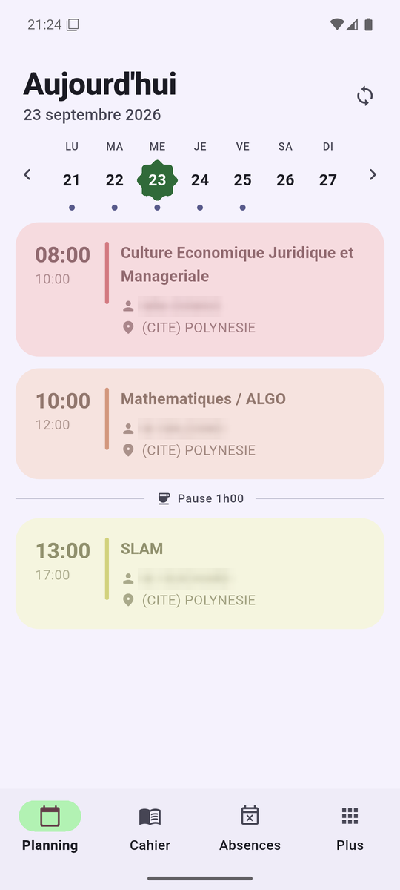
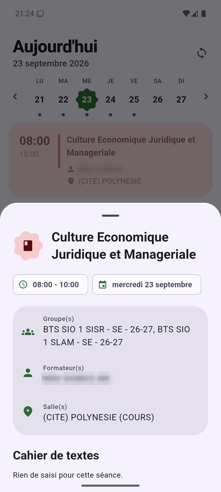
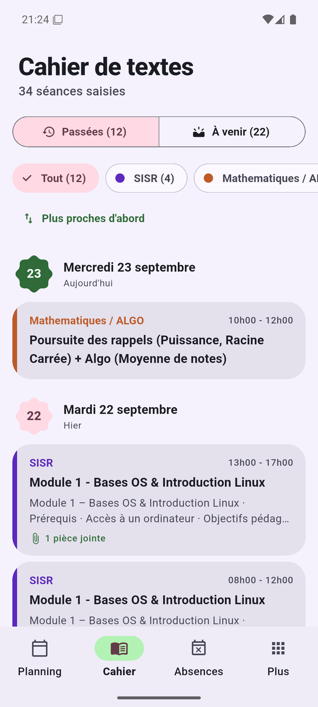
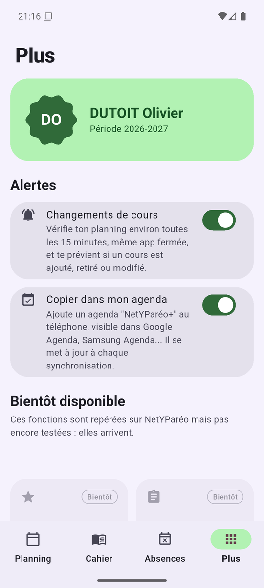

<p align="center"></p>

# 📱 NetYParéo+ (cfai-netypareo-plus)

Bienvenue sur le dépôt de **NetYParéo+**, une application Flutter pour consulter NetYParéo, le portail des apprentis du CFAI LDA de Saint-Étienne, sans passer par le site.

> 🐒 L'idée vient de [Papillon](https://github.com/PapillonApp), l'application qui remplace celles de Pronote et d'École Directe. Ici, c'est la même démarche pour NetYParéo : un portail lent, pensé pour un écran d'ordinateur, devient une application mobile rapide.

| Où ? | Quoi ? |
| --- | --- |
| [Ce dépôt](https://github.com/Teksya/cfai-netypareo-plus) | Le code de l'application Flutter |
| [docs/netypareo-api.md](docs/netypareo-api.md) | La carte des endpoints de NetYParéo, relevés sur l'instance du CFA |
| [netypareo.citedesentreprises.org](https://netypareo.citedesentreprises.org/netypareo/) | Le portail officiel, que l'application interroge |

### 📚 Concept du projet

NetYParéo contient tout ce dont un apprenti a besoin : l'emploi du temps, le calendrier centre / entreprise, les notes, les absences, le cahier de textes, le travail à faire et les documents. Le site est lent sur téléphone, la session expire vite, et il ne prévient de rien. **NetYParéo+** reprend ces données dans une application pensée pour le téléphone, avec une synchronisation en arrière-plan et des notifications.

### 🚀 Fonctionnalités

Déjà dans l'application (version 0.2, Android) :

- **Connexion** avec ton compte NetYParéo, reconnexion automatique quand la session expire.
- **Emploi du temps** par jour, avec la semaine en haut, consultable hors ligne. Le cours en cours est mis en avant, les pauses sont affichées.
- **Détail d'une séance** : salle, formateur, groupes, contenu du cahier de textes.
- **Cahier de textes** : séances passées ou à venir, tri au choix, filtre par matière.
- **Pièces jointes** : téléchargées puis ouvertes dans l'application adaptée du téléphone.
- **Travail à faire** : devoirs rangés par date d'échéance, filtre par matière, consignes et pièces jointes, bouton « Fait » qui met à jour NetYParéo.
- **Absences**.
- **Documents** : l'espace documentaire (bulletins, préinscription…), dossier par dossier, fichiers ouverts d'un appui.
- **Documents de liaison** : les échanges avec le CFA et l'entreprise, avec ceux à retourner mis en avant.
- **Tout s'affiche tout de suite** : chaque écran montre la dernière version enregistrée, se met à jour en arrière-plan et se redessine si quelque chose a changé. Hors ligne, un bandeau le signale.
- **Alertes de changement de cours** : environ toutes les 15 minutes, même application fermée, le planning est vérifié. Une notification détaille chaque cours ajouté, retiré ou modifié (horaire, salle, formateur) et ouvre le cours d'un appui. Se coupe dans l'onglet "Plus".
- **Copie dans l'agenda du téléphone** (option) : un agenda "NetYParéo+" apparaît dans Google Agenda, Samsung Agenda, etc., et suit chaque synchronisation. Le couper supprime cet agenda, les autres ne sont jamais touchés.
- Interface **Material 3 Expressive**, couleurs tirées du fond d'écran (Android 12 et plus), thème clair et sombre.

Prévu (visible et grisé dans l'onglet "Plus") :

- **Notes et bulletin**, **calendrier centre / entreprise**.

### 📸 Aperçu

| Planning | Détail d'un cours | Cahier de textes | Alertes et agenda |
| :---: | :---: | :---: | :---: |
|  |  |  |  |

Captures faites avec un vrai compte. Les noms des formateurs sont masqués.

### 🔍 Jusqu'où va le projet

- La première version tourne sur Android. Elle a été testée sur un émulateur (Android 16) avec un vrai compte apprenant.
- NetYParéo n'a **pas d'API officielle**. L'application lit les mêmes pages et les mêmes appels que le site : si YMAG (l'éditeur) change le site, une partie de l'application peut cesser de fonctionner jusqu'à sa mise à jour.
- Les notes n'ont pas encore été testées : aucune note n'était saisie au moment de l'exploration (septembre 2026).
- L'application **lit** presque tout : la seule écriture est le bouton « Fait » du travail à faire. Rendre un devoir ou déposer un document restent à faire sur le site.

## 🛠️ Comment ça marche

Le détail est dans [docs/netypareo-api.md](docs/netypareo-api.md). En résumé :

1. **Connexion** : `POST /authentication/` avec l'identifiant, le mot de passe et le jeton CSRF de la page de connexion. La session est ensuite gardée dans un cookie.
2. **Emploi du temps** : le flux iCalendar personnel de l'apprenant. Il fonctionne sans session, ce qui permet la synchronisation en arrière-plan.
3. **Le reste** : du JSON quand le site en fournit (planning, jours de cours, calendrier), sinon la lecture des pages HTML. Les pages sont encodées en `windows-1252`, le JSON en UTF-8.
4. **Alertes** : une tâche WorkManager relit le flux iCal toutes les 15 minutes (le minimum d'Android), compare avec la version enregistrée séance par séance, et envoie une notification locale par changement. Rien ne passe par un serveur tiers.
5. **Cache** : chaque page lue sur le site est gardée sur le téléphone (300 pages au plus, effacées à la déconnexion). L'écran s'affiche avec elle, puis avec la version à jour dès qu'elle arrive.
6. **Maintien de la session** : `GET /rester-connecter/`, appelé tant que l'application est ouverte.
7. **Certificat** : le serveur du CFA n'envoie pas son certificat intermédiaire (Sectigo DV R36). Les navigateurs s'en passent, pas Android : l'application l'embarque dans `assets/certs/` pour compléter la chaîne. La vérification TLS reste complète.

### 🗂️ Structure du code

```text
lib/
├── core/            Accès réseau : cookies, décodage windows-1252, connexion
├── data/            Modèles, lecture des pages (parsers), état de l'application et cache
└── ui/              Écrans (planning, travail, cahier, absences, documents, plus) et composants Material 3 Expressive
test/                Tests des parsers, sur des données fictives
tool/gen_logo.dart   Génère le logo en SVG
```

## 🚀 Lancer l'application en local

Il te faudra [Flutter](https://docs.flutter.dev/get-started/install) (canal stable).

```bash
git clone https://github.com/Teksya/cfai-netypareo-plus.git
cd cfai-netypareo-plus
flutter pub get
flutter run
```

| Commande | Effet |
| --- | --- |
| `flutter pub get` | Installe les dépendances (à faire une fois, après le clone) |
| `flutter run` | Lance l'application sur un téléphone ou un émulateur |
| `flutter test` | Lance les tests |
| `flutter build apk` | Construit l'application Android |

Paquets principaux : `dio` et `cookie_jar` (requêtes et session), `html` (lecture des pages), `flutter_secure_storage` (identifiants), `dynamic_color` (couleurs du fond d'écran), `open_filex` (pièces jointes), `workmanager` et `flutter_local_notifications` (alertes), `device_calendar_plus` (agenda).

## 📝 Contribution

1. **Forke** le dépôt (bouton "Fork" en haut à droite).

> Un **fork** est une copie du dépôt sur ton propre compte GitHub. Tu peux y travailler sans risque : l'original n'est pas touché. Quand ta modification est prête, tu demandes à l'intégrer au projet principal avec une pull request.

2. **Clone** ton fork sur ta machine :
    ```bash
    git clone https://github.com/<ton-pseudo>/cfai-netypareo-plus.git
    ```
3. **Crée** une nouvelle branche pour ta modification :
    ```bash
    git checkout -b <branche>
    ```
4. **Fais** ta modification, vérifie que les tests passent, puis **commite** :
    ```bash
    flutter test
    git add .
    git commit -m "Décris ta modification en une phrase"
    ```
5. **Pousse** vers ton fork :
    ```bash
    git push -u origin <branche>
    ```
6. **Ouvre** une pull request vers le dépôt principal.

Un endpoint a changé, ou tu en as trouvé un nouveau ? Mets à jour [docs/netypareo-api.md](docs/netypareo-api.md) dans la même pull request.

## ✅ Validation des contributions

Les pull requests sont relues et testées avant d'être fusionnées. Utilise les commentaires de la pull request pour suggérer des améliorations.

> ⚠️ Règle d'or : **aucune donnée personnelle dans le dépôt**. Pas d'identifiant ni de mot de passe, pas de lien iCal (il donne accès au planning sans mot de passe), pas de nom, d'adresse ou de numéro de contrat, pas de capture d'écran sans l'accord de la personne dont c'est le compte, et toujours avec les noms des formateurs masqués. Git garde tout dans son historique.

## 🔒 Les règles de sécurité

- **Les identifiants restent sur le téléphone**, dans le stockage sécurisé du système (`flutter_secure_storage`). Ils ne sont jamais écrits dans un journal.
- **Aucun serveur intermédiaire** : l'application parle directement à l'instance NetYParéo du CFA.
- **Le lien iCal est personnel.** Il est stocké comme un mot de passe et n'est jamais partagé.
- **Rien n'est codé en dur** : les numéros d'apprenant et d'inscription sont lus sur le site après la connexion.
- **Pas de martèlement du serveur** : les données sont mises en cache et la synchronisation reste espacée.

## ⚖️ Avertissement

Projet **non officiel**, sans lien avec YMAG ni avec le CFA. Chaque utilisateur se connecte avec son propre compte et ne voit que ses propres données.

## 📄 Licence

[MIT](LICENSE), copyright Olivier Dutoit et contributeurs.

---

<br>
Créé avec ❤️ en 2026 par Olivier Dutoit, promo BTS SIO 2026-2028 du CFAI LDA de Saint-Étienne.
